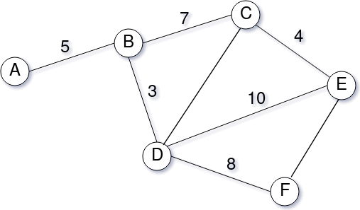

# Resposta ao Desafio Técnico
Resposta ao Desafio Técnico proposto pela equipe Vagas.com.

>"Um recrutador precisa analisar as candidaturas recebidas para vagas de emprego. Dado o grande volume de candidaturas em algumas vagas, olhar um a um seria um trabalho muito demorado. Seu papel aqui é ajudar o recrutador, indicando as pessoas mais aderentes para cada vaga. Para isso, crie uma API de acordo com as especificações ..."

### Versões utilizadas no desenvolvimento
* Linux Ubuntu 14.04 LTS 64bits
* Python 3.4.3
* Django 2.0.4
* DjangoRestFramework 3.9.1

[Clique aqui para acessar a Api Web](https://roque-desafio-vagas.herokuapp.com) ou acesse diretamente via endpoints.

### Endpoints
```
vagas:        https://roque-desafio-vagas.herokuapp.com/v1/vagas/
pessoas:      https://roque-desafio-vagas.herokuapp.com/v1/pessoas/
candidaturas: https://roque-desafio-vagas.herokuapp.com/v1/candidaturas/
```

### Considerações
Inicialmente gostaria de agradecer pela participação. Espero ter produzido uma solução com a robustez, flexibilidade e expansibilidade bem próximos do desejado.

O Django evolui muito rápido e infelizmente não descobri como fazer para criar *exatamente* o endpoint para o ranking, mas eu criei um bem próximo. O resultado é o mesmo.

### Gráfico de Nodes utilizado


Para satisfazer o algoritmo Dijkstra duas edges tiveram que ser adicionadas. O resultado das distâncias, contudo, permanece o mesmo. Eu desejei criar um cache, mas o problema proposto, pela quantidade de nodes, pesou em minha decisão de dedicar o tempo valioso em outras partes do sistema.

### Uso na prática

**Cadastro de Vagas:**
```POST https://roque-desafio-vagas.herokuapp.com/v1/vagas/```
* Body
```json
{
    "empresa": "Empresa XYZ",
    "titulo": "Fullstack Developer",
    "descricao": "O candidato deverá possuir as seguintes...",
    "localizacao": "A",
    "nivel": 3
}
```
**Cadastro de Pessoas**
```POST https://roque-desafio-vagas.herokuapp.com/v1/pessoas/```
* Body
```json
{
    "nome": "Ricardo Roque",
    "profissao": "Engenheiro de Software",
    "localizacao": "C",
    "nivel": 5
}
```
**Cadastro de Candidaturas**
```POST https://roque-desafio-vagas.herokuapp.com/v1/candidaturas/```
* Body
```json
{
    "id_vaga": 1,
    "id_pessoa": 1
}
```
**Ranking de Candidaturas**
```GET https://roque-desafio-vagas.herokuapp.com/v1/vagas/1/ranking/```
* Response
```... Surprise!```
